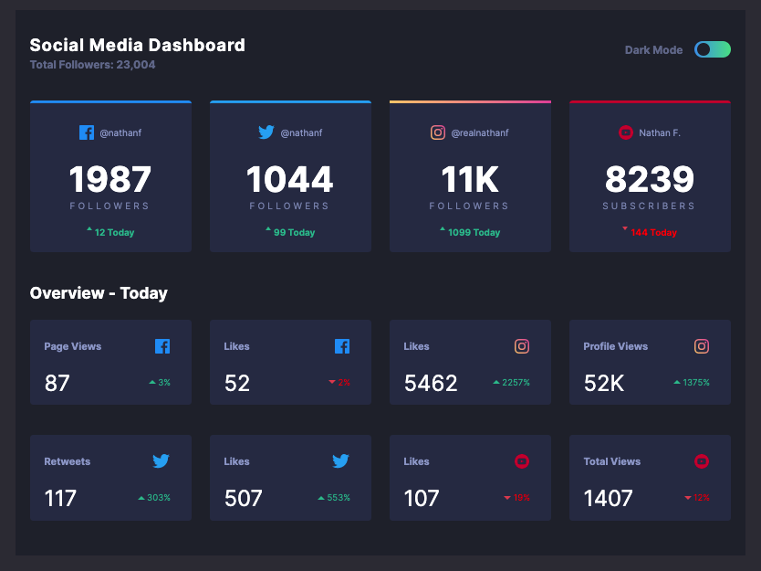

# Frontend Mentor - Social media dashboard with theme switcher solution

This is a solution to the [Social media dashboard with theme switcher challenge on Frontend Mentor](https://www.frontendmentor.io/challenges/social-media-dashboard-with-theme-switcher-6oY8ozp_H). Frontend Mentor challenges help you improve your coding skills by building realistic projects.

## Table of contents

-   [Overview](#overview)
    -   [The challenge](#the-challenge)
    -   [Screenshot](#screenshot)
    -   [Links](#links)
-   [My process](#my-process)
    -   [Built with](#built-with)
    -   [What I learned](#what-i-learned)
    -   [Continued development](#continued-development)
    -   [Useful resources](#useful-resources)
-   [Author](#author)

## Overview

### The challenge

Users should be able to:

-   View the optimal layout for the site depending on their device's screen size
-   See hover states for all interactive elements on the page
-   Toggle color theme to their preference

### Screenshot

### Links

-   Solution URL: [Frontend Mentor](https://www.frontendmentor.io/solutions/dashboard-with-theme-switcher-using-react-styled-comp-js-htmlcss-VG_S4WGGB)
-   Live Site URL: [Dashboard and Theme Switcher](https://dashboard-theme-switcher.scottjohnston.dev)

## My process

### Built with

-   HTML5 markup
-   CSS
-   Flexbox
-   CSS Grid
-   Mobile-first workflow
-   [React](https://reactjs.org/) - JS library
-   [Styled Components](https://styled-components.com/) - For styles

### What I learned

More exposure to styled components in React. Additional learning using Grid. Implementing a theme switch component.

### Continued development

I plan to continue getting more familiar and experience with Styled Components along with Grid. I also need to refactor a number of areas.

## Author

-   Website - [Scott Johnston](https://www.scottjohnston.dev)
-   Frontend Mentor - [@SJ47](https://www.frontendmentor.io/profile/SJ47)
-   Twitter - [@scottJ_Dev](https://www.twitter.com/scottJ_Dev)
